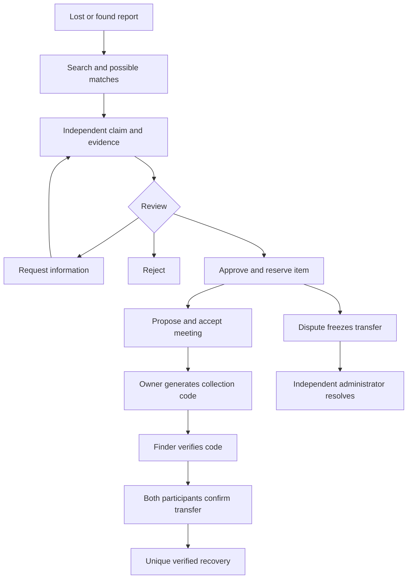

# Architecture

The client is an Expo SDK 56 React Native app for Android and iOS. Firebase Authentication identifies users; Firestore and Storage enforce read boundaries; trusted Cloud Functions own workflow changes. There is no required website deployment.

## Data and permissions

| Collection      | Purpose                                          | Read access                                                               |
| --------------- | ------------------------------------------------ | ------------------------------------------------------------------------- |
| reports         | Safe discovery attributes and lifecycle state    | Verified eligible members for browseable reports; author/admin for drafts |
| reportPrivate   | Previously recorded ownership clues              | Report author and administrator                                           |
| claims          | Independent ownership answers and review history | Claimant, finder, administrator                                           |
| evidence        | Evidence metadata; image stored separately       | Claimant and administrator                                                |
| handovers       | Appointment and both confirmations               | Case participants and administrator                                       |
| handoverSecrets | Salted code verifier, expiry and attempts        | Server only                                                               |
| disputes        | Frozen case and resolution                       | Participants and administrator                                            |
| matches         | Explainable candidate pairs                      | Report authors and administrator                                          |
| auditEvents     | Append-only server events                        | Event participants and administrator                                      |
| notifications   | In-app updates                                   | Recipient                                                                 |
| recoveries      | Unique completed transfer records                | Administrator                                                             |
| users           | Eligibility, suspension and profile              | Account owner and administrator                                           |

Clients cannot write reports, claims, privileges, audit events or recovery counts directly. They call the authenticated `workflow` function. Exceptions are constrained bookmark writes and notification read flags. Administrative access requires both a custom claim and the server-owned `adminEnabled` field so stale tokens do not retain read access after revocation. Suspended users are blocked by rules as well as Authentication.

## Recovery flow

Lost/found is a report type, not recovery status. Closing a report does not create a recovery. Approval and reservation are transactional so competing claims cannot reserve the same item twice. Sensitive categories and competing claims require independent administrative review. Neither claimant nor the finder of a sensitive item may approve their own case as administrator.

Collection codes are cryptographically generated, hashed with a salt, expire after ten minutes, and lock after five incorrect attempts. A code alone never marks a recovery: both participants must confirm. Operation IDs protect retries; the code itself is not stored in operation records. Hourly maintenance escalates expired handovers and removes terminal-case evidence after 90 days where no open dispute exists.

## Mobile behavior

Bottom tabs cover Browse, Report, My activity and Updates. Authentication gates mount inside the root navigator and preserve known deep-link destinations. Camera/library selection, image resizing, date/time selection, safe areas and keyboard avoidance use native APIs. Photos are re-encoded before upload; ID card photos are suppressed. Protected images use authenticated downloads into temporary local cache, cleaned up after use.

Firebase client configuration is public application configuration. Service-account credentials must never enter the app or any `EXPO_PUBLIC_` variable. Real-device permissions, accessibility, screen layout, resume behavior and protected downloads still require device verification.

## Matching and limits

The initial matcher is deterministic and explainable. It uses category, brand, color, campus location, date compatibility and public words. Private clues and claimant evidence never contribute to suggestions. A suggestion is not ownership verification.

Matching currently considers at most 100 open opposite-type reports in the category and 200 existing suggestions per update. Search uses indexed public prefix tokens; it is not fuzzy full-text search. These bounds keep initial costs predictable but need evaluation against a larger campus dataset before scale claims. Notifications are in-app; operating-system push delivery is not implemented.
